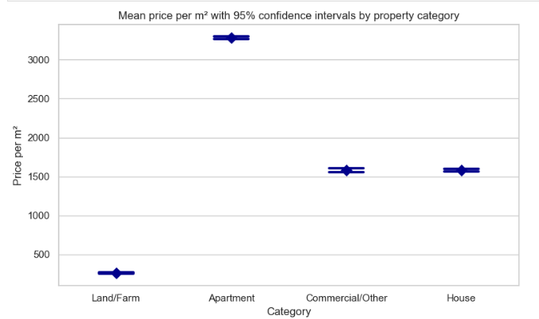
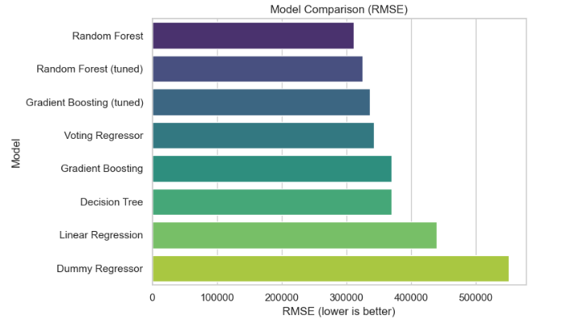

#  **Real Estate Price Analysis & Prediction (Portugal)**

---

## 🔹 Project Overview

This project analyzes real estate listings in Portugal to understand key price drivers and build predictive models for property valuation.

The analysis combines:

* Data cleaning and feature engineering
* Exploratory data analysis (EDA)
* Statistical inference
* Machine learning modeling

---

##  Key Results

* Property prices vary significantly across regions and categories
* **Price per square meter** is a more stable metric than raw price
* Property type and location are strong price drivers
* Random Forest provides the best predictive performance

 The model captures pricing patterns but highlights high variability in the market

---

## 🔹 Dataset

* Real estate listings across Portugal
* Includes:

  * Price
  * Total area
  * Number of rooms and bathrooms
  * Property type
  * Location (district/city)
  * Energy efficiency

---

## 🔹 Data Preparation

Key steps:

* Removed unrealistic values (e.g., price = 0 or extreme outliers)
* Handled inconsistent and missing entries
* Created new features:

```text
price_per_m2 = Price / TotalArea
area_per_room = TotalArea / TotalRooms
bathrooms_per_room = Bathrooms / TotalRooms
living_area_ratio = LivingArea / TotalArea
```

* Cleaned and ordered **energy efficiency categories**

---

## 🔹 Exploratory Data Analysis

Key observations:

* Strong right-skew in price distribution
* Extreme outliers present in multiple features
* Price differences across regions are substantial
* Larger properties do not always scale linearly in price

---

## 🔹 Statistical Analysis

* Compared price differences across categories
* Constructed **confidence intervals** for price per m²

 Example visualization:



---

## 🔹 Modeling

Models tested:

* Linear Regression
* Random Forest Regressor

 Model comparison:



---

## 🔹 Model Performance

* Random Forest achieved the best performance
* Captures nonlinear relationships better than linear models
* Still limited by:

  * Data noise
  * Missing property-specific features

---

## 🔹 Business Interpretation

* Location and property type are primary drivers of value
* Price per m² is more reliable than total price for comparison
* High variability suggests:

  * Market inefficiencies
  * Opportunity for better pricing models

 This model can support:

* Property valuation tools
* Investment decision-making
* Market analysis

---

## 🔹 Limitations

* Data quality issues (outliers, inconsistencies)
* Missing features (e.g., condition, renovation status)
* Model performance constrained by real-world noise

---

## 🔹 Structure

real-estate-price-analysis/  
│  
├── notebooks/  
│   └── real_estate_listings_in_portugal.ipynb  
│
├── images/  
│   ├── category_confidence_intervals.png  
│   └── model_rmse_comparison.png  
│
├── README.md  
└── requirements.txt  

---

## 🔹 Tech Stack

* Python
* pandas, numpy
* matplotlib, seaborn
* scikit-learn

---

## 🔹 How to Run

1. Clone repository
2. Install dependencies

```bash
pip install pandas numpy matplotlib seaborn scikit-learn
```

3. Open notebook:

```bash
notebooks/real_estate_listings_in_portugal.ipynb
```

---

##  Final Note

This project demonstrates how combining **data cleaning, statistical analysis, and machine learning** can provide meaningful insights into complex and noisy real estate markets.
